# NYC Taxi Analysis

## Project Overview
In this project we will be analysing NYC taxi data using Azure Synapse Analytics. Synapse Analytics is a Limitless analytics service that brings together data integration, enterprise data warehousing and big data analytics. Azure Synpase Analytics is one such service that solves all data engineers problems of using multiple services on their day to day activities, with the help of synapse we can perfom all 3 ETL operations Integration, transformation, Reporting.

## Tools

- Azure Synapse Analytics
- Azure Cosmos DB
- Azuer Storage service

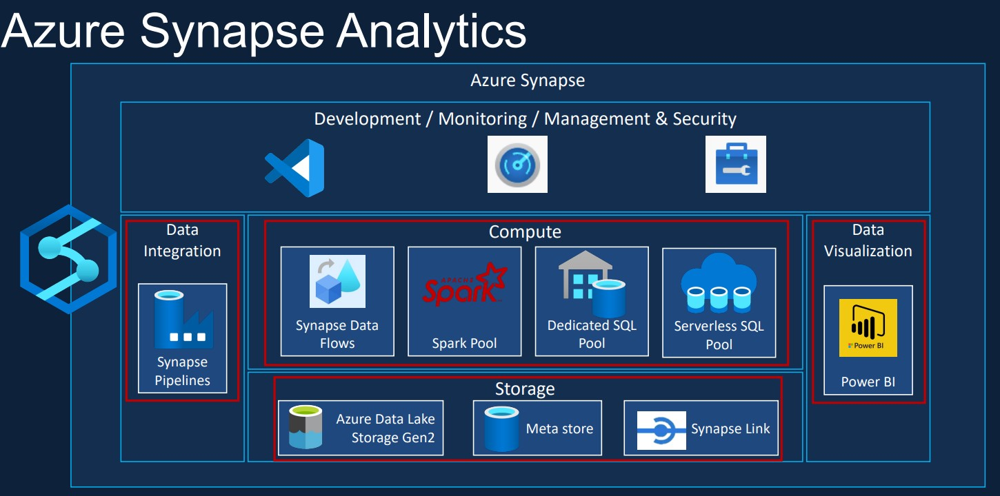

### Environment Setup

- Create a Azure acccount using Azure portal.
- Create a resource group to have all services at one place.
- Create and configure Storagee Account(Blob Storage and ADLS GEN2).
- Create and configure Azure Synapse Analytics.
- Download and configure Power BI.

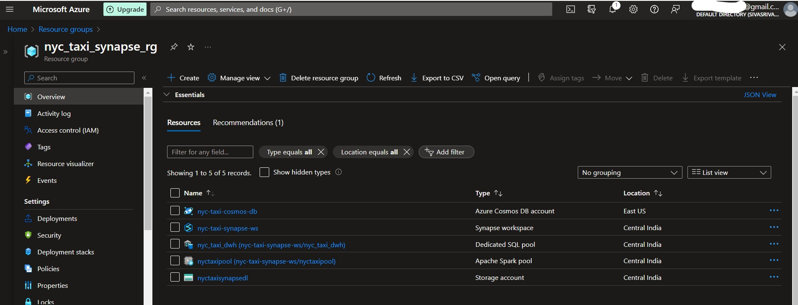

### Project Implementation

- Let's divide this project into typical data engineering project
  1. Data Ingestion
  2. Data Transformation
  3. Data Reporting

#### Solution Architecture

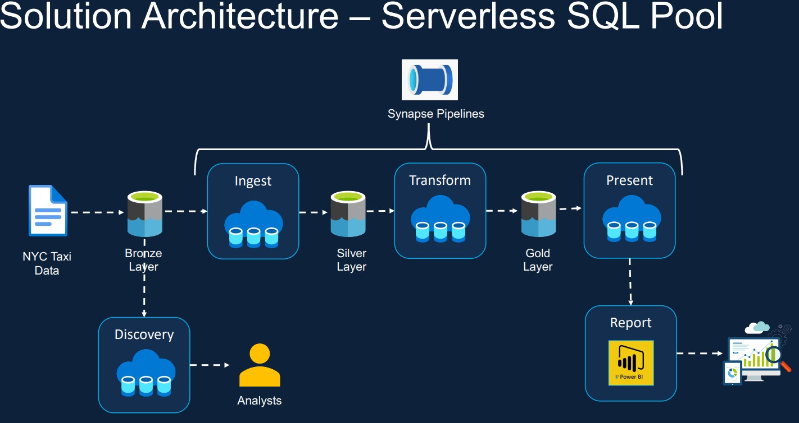


##### Data Discovery

- Before diving into data ingestion, let's explore the data we have
  1. Data exploration capability on the raw data
  2. Schema applied to the raw data
  3. Data Discovery using T-SQL
  4. Data Discovery using pay-per-query model
  
- we will be exploring our data in datalake using serverless sql pool, serverless sql pool comes with synapse workspace hence we don't need to configure anything. As the name describes serverless sql pool is serverless and we will be only charged for the data we proceseed.
- serverless sql pool provides OPENROWSET function which will help in querying data in Azure storage. It does support multiple formats to read.
- Below is the synatax for reading `` PARQUET, DELTA, CSV`` files.
  
```
--OPENROWSET syntax for reading Parquet or Delta Lake files
OPENROWSET  
( { BULK 'unstructured_data_path' , [DATA_SOURCE = <data source name>, ]
    FORMAT= ['PARQUET' | 'DELTA'] }  
)  
[WITH ( {'column_name' 'column_type' }) ]
[AS] table_alias(column_alias,...n)

--OPENROWSET syntax for reading delimited text files
OPENROWSET  
( { BULK 'unstructured_data_path' , [DATA_SOURCE = <data source name>, ] 
    FORMAT = 'CSV'
    [ <bulk_options> ]
    [ , <reject_options> ] }  
)  
WITH ( {'column_name' 'column_type' [ 'column_ordinal' | 'json_path'] })  
[AS] table_alias(column_alias,...n)
 
<bulk_options> ::=  
[ , FIELDTERMINATOR = 'char' ]    
[ , ROWTERMINATOR = 'char' ] 
[ , ESCAPECHAR = 'char' ] 
[ , FIRSTROW = 'first_row' ]     
[ , FIELDQUOTE = 'quote_characters' ]
[ , DATA_COMPRESSION = 'data_compression_method' ]
[ , PARSER_VERSION = 'parser_version' ]
[ , HEADER_ROW = { TRUE | FALSE } ]
[ , DATAFILETYPE = { 'char' | 'widechar' } ]
[ , CODEPAGE = { 'ACP' | 'OEM' | 'RAW' | 'code_page' } ]
[ , ROWSET_OPTIONS = '{"READ_OPTIONS":["ALLOW_INCONSISTENT_READS"]}' ]

<reject_options> ::=  
{  
    | MAXERRORS = reject_value,  
    | ERRORFILE_DATA_SOURCE = <data source name>,
    | ERRORFILE_LOCATION = '/REJECT_Directory'
}
```

- The major parameters are bulk and format, for csv we need to mention rowterminator, parser version, firstrow, header_row etc if our file is different from traditional csv.
- Let's query taxi zone data using T-sql
- Below we've created a data source which will holds our file path infomation.
- Through WITH clause we're explictly defining data type length and it's order to save amount of data/memory being processed. but make sure you specify column names correctly as it WITH clause is CASE SENSITIVE.
- You can also check the data type lengths using the storage procedure ``sp_describe_first_result_set``
- Just like above, explore other CSV files CALENDAR, VENDOR. TRIP TYPE is also same but with TAB as Field terminator.
  
``` Refer to taxizone, calendar, vendor and trip tsv scripts in sql script folder ```

###### Reading JSON type files

- Coming to json file types, need to make sure we pass correct ROWTERMINATOR and FIELDTERMINATOR.
- With the help of JSON VALUE and OPEN json functions we can query json files.
-  CROSS APPLY works just like JOIN in SQL.
- If there is nested json structure, just apply OPENJSON on inner json structure.

``` Refer to rate code and payment scripts in sql script folder ```


###### Reading data inside folders

- There are cases where in we need to read all files inside folder, in those cases we need to make use of wildcard characters '*', '**'
- '*.csv will read only CSV files in folder.
- '**' will read all file types present in the folder.
- We can also make use of metadata functions like filepath and filename, these will give you total filepath name in datalake.
  
``` Refer to trip data green script in sql script folder ```

###### Reading PARQUET and DELTA Files

- The syntax is pretty much straight forward here, the only challenge is we can't query subfolder data of DELTA files as it's metadata will be store in the first folder.
- If we want to check subfolder data, we can use WHERE clause to filter specific subfolder.
- While reading delta files we have to specify the partition columns in with clause without fail.

``` Refer to trip data scripts in sql script folder ```

###### Data Virtualisation

- The drawbacks of OPENROWSET function leads us to data virtualisation, we can only query data using OPENROWSET function, but for reporting we need to store this data somewhere as either tables or views.
- with data virtualisation, we will create external tables on top of our data lake.
- To create external tables, we need external data source and data formats.
- External data source wil hold the source path info, data formats will define the file schema that we used to define OPENROWSET function.

```
-- Create an external file format for DELIMITED (CSV/TSV) files.
CREATE EXTERNAL FILE FORMAT file_format_name
WITH (
        FORMAT_TYPE = DELIMITEDTEXT
    [ , FORMAT_OPTIONS ( <format_options> [ ,...n  ] ) ]
    [ , DATA_COMPRESSION = {
           'org.apache.hadoop.io.compress.GzipCodec'
        }
     ]);

<format_options> ::=
{
    FIELD_TERMINATOR = field_terminator
    | STRING_DELIMITER = string_delimiter
    | FIRST_ROW = integer -- Applies to: Azure Synapse Analytics and SQL Server 2022 and later versions
    | DATE_FORMAT = datetime_format
    | USE_TYPE_DEFAULT = { TRUE | FALSE }
    | ENCODING = {'UTF8' | 'UTF16'}
    | PARSER_VERSION = {'parser_version'}

}

CREATE EXTERNAL DATA SOURCE <data_source_name>
WITH
  ( [ LOCATION = '<prefix>://<path>[:<port>]' ]
    [ [ , ] CONNECTION_OPTIONS = '<key_value_pairs>'[,...]]
    [ [ , ] CREDENTIAL = <credential_name> ]
    [ [ , ] PUSHDOWN = { ON | OFF } ]
  )
[ ; ]
```
- Let's create external data source and external data formats of CSV, TSV, DELTA, PARQUET using above synatax.
- We will follow industry standards, let's create a database ```LDW ``` and schema ```BRONZE```.
- Once we have both database and schema we're good to go.

```
-- Create a new external table
CREATE EXTERNAL TABLE { database_name.schema_name.table_name | schema_name.table_name | table_name }
    ( <column_definition> [ ,...n ] )
    WITH (
        LOCATION = 'folder_or_filepath',
        DATA_SOURCE = external_data_source_name,
        [ FILE_FORMAT = external_file_format_name ]
        [ , <reject_options> [ ,...n ] ]
    )
[;]

<reject_options> ::=
{
    | REJECT_TYPE = value | percentage
    | REJECT_VALUE = reject_value
    | REJECT_SAMPLE_VALUE = reject_sample_value,
    | REJECTED_ROW_LOCATION = '/REJECT_Directory'
}

<column_definition> ::=
column_name <data_type>
    [ COLLATE collation_name ]
    [ NULL | NOT NULL ]
```

- Create external tables for all demilimited files(taxi zone, vendor, calendar, trip data)
- Create external tables for PARQUET and DELTA file types as well.
- Create external views for payment and rate code json files. Creating a view is as simple as create a table in SQL
- A view is a virtual table that is created by using SELECT statement. 

```
CREATE VIEW SCHEMA.TABLE_NAME
AS
SELECT STATEMENT
```

``` Refer to the scripts in LDW folder in sql scripts ```
  
 #### Data Ingestion

 - Key objectives in data ingestion
   1. Ingested data to be stored as Parquet
   2. Ingested data to be stored as tables/ views
   3. Ability to query the ingested data using SQL
   4. Ingestion using pay-per-query model
  
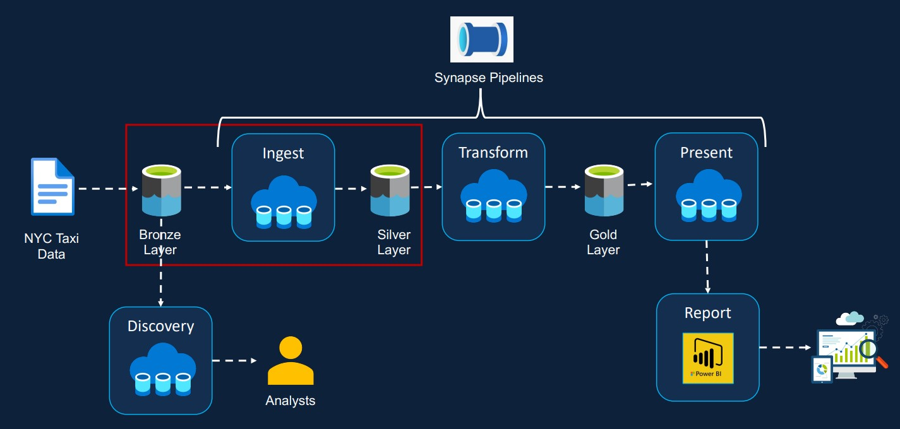

- Now coming to data ingestion, we will ingest all data in PARQUET format.
- Let's create tables in SILVER layer using CETAS statements by using existing BROZE external tables we created.
- As we have Trip data green data partitoned in CSV format, we can't create partitions directly using external table syntax.
- To store the Trip data green CSV partitoned data, we will create a STORED PROCEDURE and pass the partition values year, month as parameters.
- Create exact replica views for external views.

``` Refer to the scripts in LDW folder in sql scripts ```

 #### Data Transformation using Serverless SQL Pool

 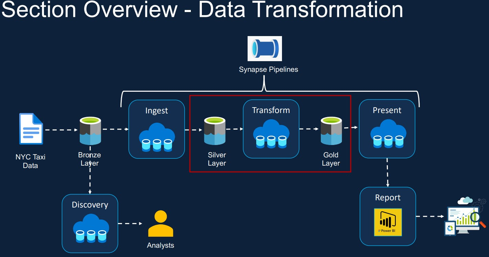

  - Key objectives in data Transfomation

    1. Join the key information required for reporting to create a new table.
    2. Join the key information required for Analysis to create a new table.
    3. Must be able to analyze the transformed data via T-SQL
    4. Transformed data must be stored in columnar format (i.e., Parquet)
       
- Now coming to data transformation, we will make use of silver tables and built aggregation on top of it and store tables in gold layer.
- we have 2 main business requirements in tranformation.

###### Business Requirements (1)

  1. Campaign to encourage credit card payments
  2. Trips made using credit card/ cash payments
  3. Payment behaviour during days of the week/ weekend
  4. Payment behaviour between boroughs

- Inorder to achieve the above business requirements we need to join silver tables.
- Trip data will give you year, month, trip date.
- Taxi zone will give borough
- Calender for the date info
- Build the logic using above tables and validate the data.

###### Business Requirements (2)

  1. Identify taxi demand
  2. Demand based on borough
  3. Demand based on day of the week/ weekend
  4. Demand based on trip type (i.e., Street hail/ Despatch)
  5. Trip distance, trip duration, total fare amount etc per day/ borough

- Create a view on top of Taxi data green data by using stored procedure in GOLD schema.
- On we have the view, we can now move on to business requirements-2
- Build the logic using gold tables and views

``` Refer to create_gold_trip_data_green script in LDW folder ```


#### Automating ETL using Synapse Pipelines

- Till now we have transformed our data in step wise sepereately by writing code in T-sql and executed them manually. In real world projects it's not the case, process should be made automatic to reduce manual intervention and to avoid human errors.
- Now we will automate our ETL processes using Synapse Pipelines.
- Synapse pipelines makes use of Azure Data factory but comes with some additional requirements.
- Creating pipelinese will require two things, linked service and dataset.
- Linked service will make connection among your source data and the ETL tool, In this case Azure Synapse Pipelines.

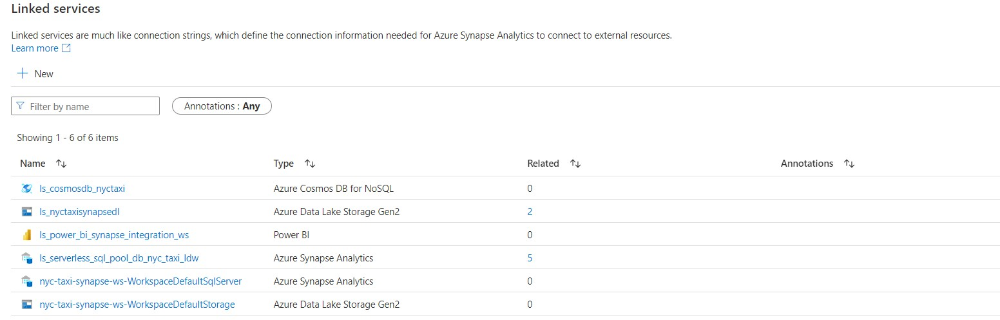

- As our data is stored in ADLS GEN2 containers, we need to create linked service among ADLS and Synapse.
- Once we create linked service, we can now access the files and data in ADLS, now we need to create a dataset. We can either create it externally or we can create while we're creating our pipeline activites.
- A dataset is something that will hold your source/destination information. 
- We will create a single pipeline for all delimited files processing

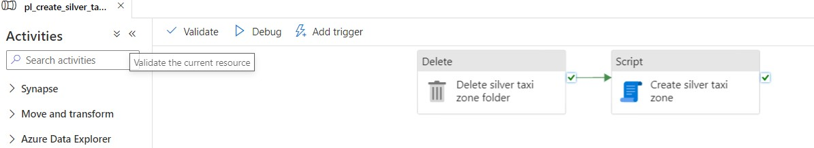

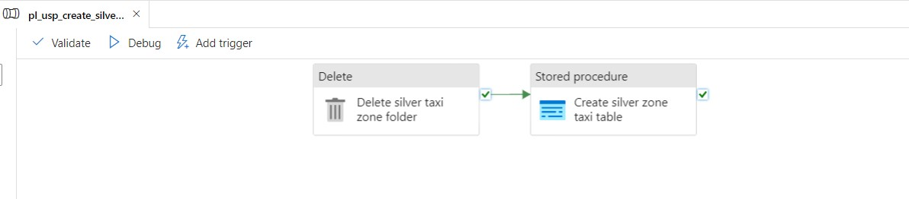

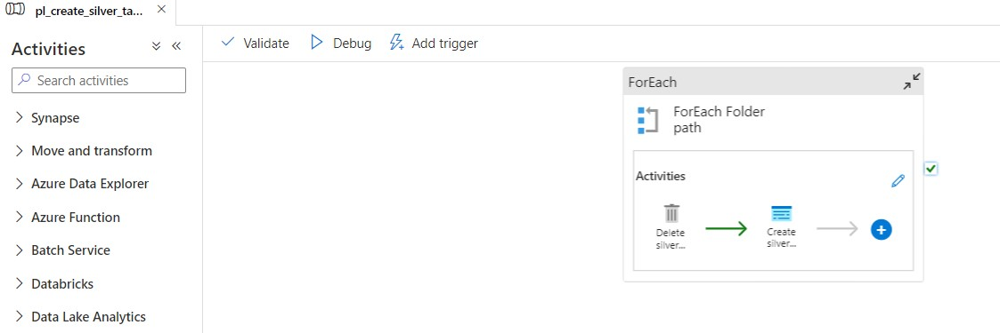

- We will create sepereate pipeline for silver trip data as the data is here in partitioned format.

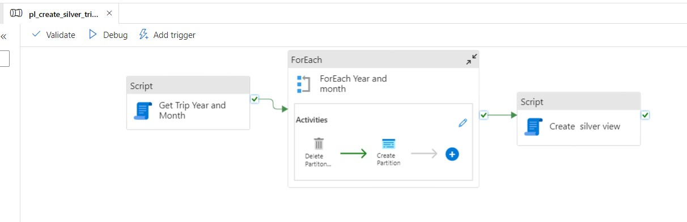

- As we now automated our processing till silver layer and let's move on to Gold layer
- Create the pipelines just like above for GOLD layer as well, create one for delimited files and other for PARQUET

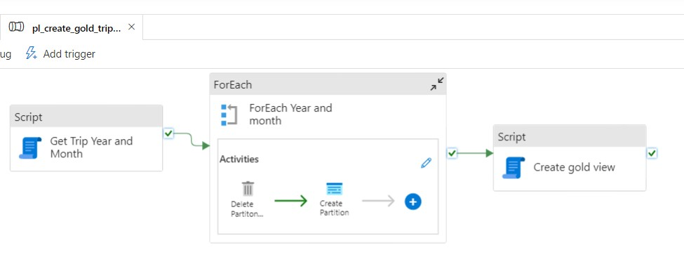

- Once we have all pipelines, let's create a dependency among them.
- Only when silver pipelines are completed without any issues, we want our GOLD pipelines to run

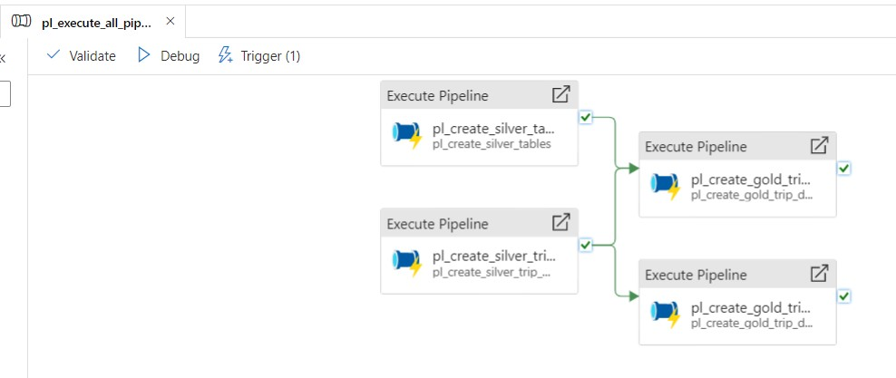

- Till now we're executing our pipelines manually by using DEBUG, to automate execution we can create triggers to our pipelines.
- Schedule trigger can be the best choice as we're not inserting any files in source folders.

 #### Data Transformation using Spark Pool

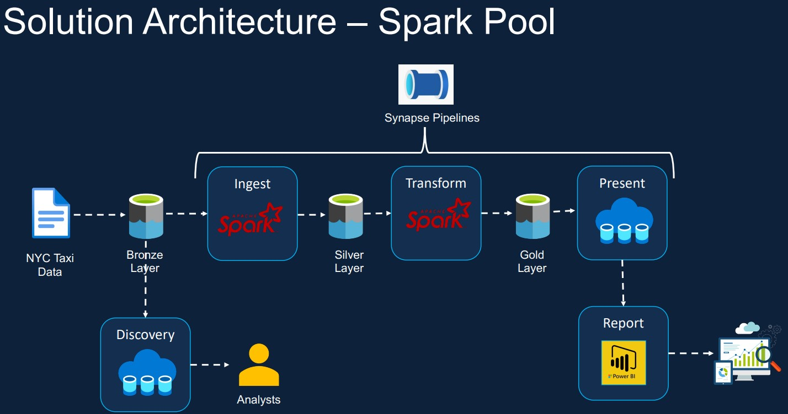

 - As of now we have transformed our data using serverless sql pool. With serverless sql pool we can't process larger datasets and T-SQL logic will be complex.
 - With Spark pool, we can process Terabytes if not Petabytes of data with ease.

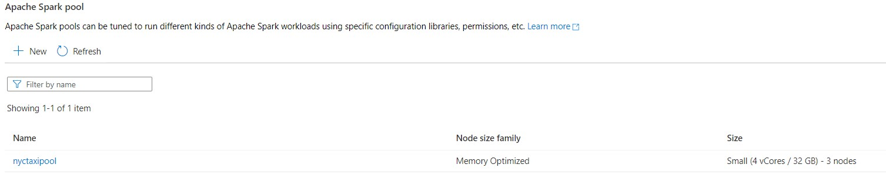

 - In Spark pool we can write logic in Pyspark, scala, R, SQL.
 - The best thing with Spark pool is that the metadata of tables is stored in MetaStore. If you want to query the tables and use for reporting we can use serverless sql pool.
 - If you want to perform any DML operations on tables, we can't do it from serverless sql pool, we need to go back to spark notebooks and do it.
 - Let's now perform some transformation on Trip data green that stored in silver container, Let's create a table Trip data green agg which we will hold the partioned by year and month.

``` Refer to databricks notebook in notebook folder ```

 - Let's create a pipeline for the same and add a trigger to it so that we can run it automatically.

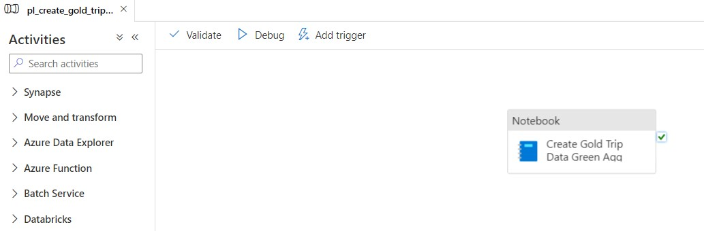

#### Azure Synapse Link

- Before we move into data reporting let's discuss once about Azure Synapse link.
- Any traditional Data Engineering architecture consits of OLTP as source and OLAP as destination.
- As we already know OLTP is row oriented and OLAP is column oriented storage formats.
- In order to replicate data from OLTP to OLAP or to create business aggregations on top of OLTP data, we require ETL/ELT tools.
- Can't we directly replicate OLTP data into OLAP database? Yes we can, and the solution from Azure for this requirement is Synapse Link.

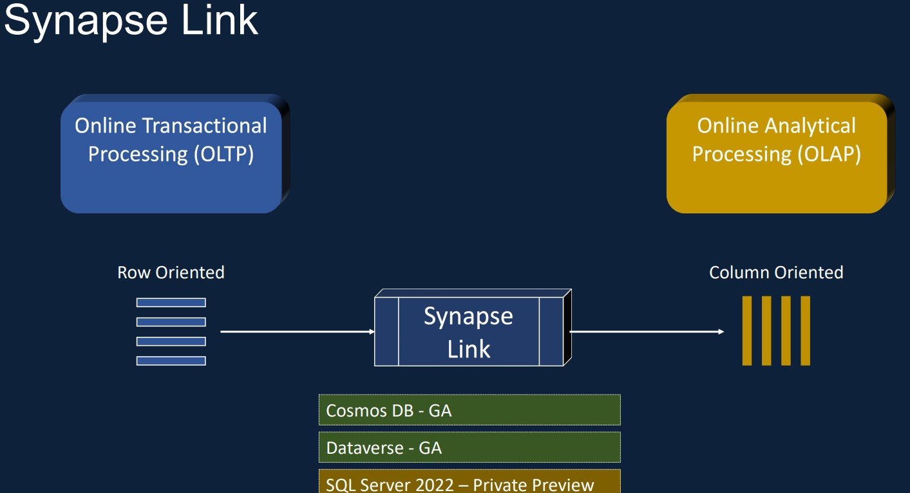

- Synpase link will help you move your row oriented OLTP data into column oriented OLAP data in near real time.
- Synpase link as of now only support CosmosDB(MangoDB API and SQL API).
  
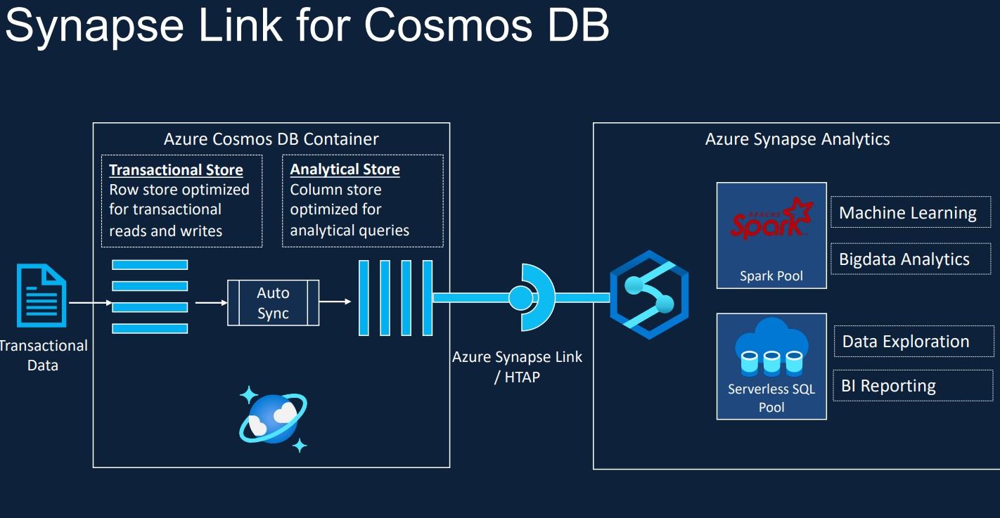

- Let's first create Azure Cosmos DB in our resource group.
- Create a linked service among synapse and cosmosDB.
- As NYC taxi doesn't provide real time data, let's insert some records manually in CosmosDB container.
- Once we have data in container, come to synapse workspace and refresh once, under linked section you could see CosmosDB connection.
- As we are now in azure synapse workspace, which containes both Serverless sql pool and Spark pool.
- Now Query the Heartbeat table data using serverless sql pool db and you can see the data that you inserted in cosmosDB earlier.
- Along with Insert and update, we can also perfrom delete operations. The changes will be reflected in synapse workspace.
- We can also crete dataframes using Spark pool and transform as required for BI reporting.

``` Refer to CosmosDB folder in Sql scripts, synpase folder in Notebooks ```
  
 #### Data Reporting

  - Key objectives in data Reporting
    1. Taxi Demand
    2. Credit Card Campaign
    3. Operational Reporting
   
 - Azure Synapse and Power BI are closely integreated than one can ever imagine.
 - Download powerBI desktop and install it, PowerBI doesn't take personal emails to login.
 - If we want to acces it, we need to create an user in Azure.
 - New user should have acessess to Resource group, Synapse workspace and ADLS.
 - We can make use of free 60days PowerBI Pro plan for reporting.
 - Once user is created and enrolled for Free plan, create a workspace in PowerBI for Publishing.
 - Create a linked service among powerBI and synapse.
 - The best thing about Synapse is we can build reports in synpase itself instead of using powerBI desktop by making use of the datasets.
 - The draw back is we can't perform modeling or transformation in synapse directly, we have to use power BI only.
 - Connect to Synapse workspace using synpase endpoint, it will give you all the databases existed in synapse workspace.
 - Load all the tables required into powerBI from databases and start building reports.

[Campain_Demand_report](https://app.powerbi.com/links/A7AJTtY3iD?ctid=fe2afe3d-4d4c-4d67-9302-813bdc2e867a&pbi_source=linkShare)

   
